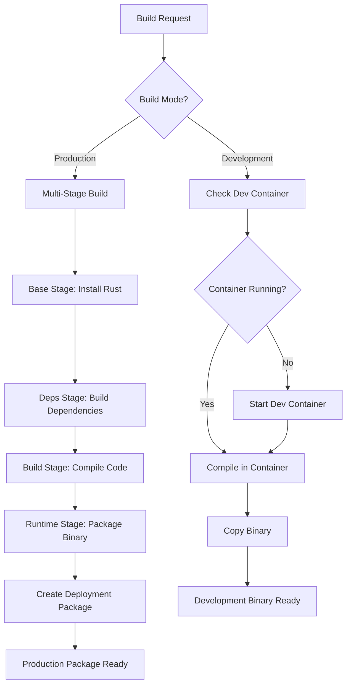

# Design Document: Docker Build Optimization

## Overview

This design implements a multi-stage Docker build system that eliminates the need to rebuild the lambda-rust-builder image on every compilation. The solution uses Docker layer caching, multi-stage builds, and persistent development containers to dramatically improve build performance while maintaining compatibility with existing workflows.

## Architecture

The optimized build system consists of three main components:

1. **Multi-Stage Dockerfile**: Separates dependency installation, compilation, and runtime stages
2. **Development Container Manager**: Manages long-running containers for iterative development
3. **Build Script Orchestrator**: Coordinates different build modes and maintains backward compatibility

### Build Flow Diagram



## Components and Interfaces

### 1. Multi-Stage Dockerfile

The new Dockerfile will have four distinct stages:

- **Base Stage**: Amazon Linux 2 with Rust toolchain (cached)
- **Dependencies Stage**: Builds project dependencies (cached until Cargo.toml changes)
- **Build Stage**: Compiles the application code
- **Runtime Stage**: Creates minimal deployment package

### 2. Development Container Manager

A shell script component that manages persistent development containers:

```bash
# Interface
dev-container.sh start    # Start development container
dev-container.sh build    # Build in existing container
dev-container.sh stop     # Stop development container
dev-container.sh status   # Check container status
```

### 3. Enhanced Build Script

The existing `build-lambda.sh` will be extended with new modes:

- `dev`: Fast development builds using persistent containers
- `prod`: Production builds using multi-stage optimization
- `docker`: Legacy mode (maintained for compatibility)

## Data Models

### Build Configuration

```rust
struct BuildConfig {
    mode: BuildMode,
    target_arch: String,
    cargo_flags: Vec<String>,
    use_cache: bool,
    container_name: String,
}

enum BuildMode {
    Development,
    Production,
    Legacy,
}
```

### Container State

```bash
# Container state tracking
CONTAINER_NAME="lambda-rust-dev"
CONTAINER_STATUS="running|stopped|not_found"
LAST_BUILD_TIME="timestamp"
SOURCE_MOUNT_PATH="/workspace"
```

## Correctness Properties

*A property is a characteristic or behavior that should hold true across all valid executions of a system—essentially, a formal statement about what the system should do. Properties serve as the bridge between human-readable specifications and machine-verifiable correctness guarantees.*

Now I need to analyze the acceptance criteria to determine which ones can be tested as properties.

### Property Reflection

After reviewing all the properties identified in the prework, I can consolidate some redundant ones:

- Properties 1.2 and 1.3 both test caching behavior and can be combined into a comprehensive caching property
- Properties 3.1 and 3.2 test opposite sides of the same caching logic and can be combined
- Properties 5.2 and 5.3 both test backward compatibility and can be combined
- Properties 4.3 and 4.4 test opposite optimization priorities and can be combined into one property

### Correctness Properties

Property 1: Docker layer caching consistency
*For any* build sequence where base dependencies remain unchanged, subsequent builds should reuse cached base layers without rebuilding the Rust toolchain
**Validates: Requirements 1.2, 1.3**

Property 2: Development container persistence
*For any* series of development builds, the container should remain running between builds and reuse the same container instance
**Validates: Requirements 2.1, 2.2**

Property 3: Automatic container lifecycle management
*For any* development build request when no container is running, the system should automatically start a new development container
**Validates: Requirements 2.3**

Property 4: Source code volume mounting
*For any* source code change on the host filesystem, the change should be immediately visible inside the development container
**Validates: Requirements 2.4**

Property 5: Dependency cache invalidation
*For any* change to Cargo.toml or Cargo.lock, dependency layers should be rebuilt, but for source-only changes, dependency layers should be reused
**Validates: Requirements 3.1, 3.2**

Property 6: Build mode optimization behavior
*For any* build mode selection, development mode should prioritize speed while production mode should prioritize deployment package size optimization
**Validates: Requirements 4.3, 4.4**

Property 7: Backward compatibility preservation
*For any* existing build command or make target, the command should continue to work and produce the same output artifacts using the optimized build process
**Validates: Requirements 5.1, 5.2, 5.3, 5.4**

Property 8: Final image minimality
*For any* production build, the final Docker image should contain only the compiled bootstrap binary and essential runtime dependencies
**Validates: Requirements 1.4**

## Error Handling

### Container Management Errors

- **Container Start Failure**: If development container fails to start, fall back to production build mode
- **Volume Mount Errors**: Validate source directory exists and is accessible before mounting
- **Container Communication Errors**: Implement retry logic for container commands with exponential backoff

### Build Process Errors

- **Cache Corruption**: Detect corrupted Docker layers and force rebuild when necessary
- **Dependency Resolution Failures**: Clear dependency cache and retry with fresh dependency resolution
- **Cross-compilation Errors**: Provide clear error messages for missing cross-compilation targets

### Compatibility Errors

- **Legacy Command Failures**: Maintain error message compatibility while using new build system
- **Artifact Generation Errors**: Ensure deployment package creation fails gracefully with helpful messages

## Testing Strategy

### Unit Testing Approach

Unit tests will focus on:
- Shell script function validation
- Docker command generation
- Configuration parsing and validation
- Error handling scenarios

### Property-Based Testing Configuration

Property-based tests will use a shell-based testing framework with Docker integration:
- **Minimum 100 iterations** per property test to ensure reliability
- **Test environment isolation** using temporary Docker contexts
- **Cleanup procedures** to remove test containers and images
- **Tag format**: **Feature: docker-build-optimization, Property {number}: {property_text}**

### Integration Testing

Integration tests will validate:
- End-to-end build workflows
- Docker layer caching behavior
- Container lifecycle management
- Backward compatibility with existing scripts

### Test Data Generation

For property-based tests, we'll generate:
- **Random source code changes** to test caching behavior
- **Various Cargo.toml configurations** to test dependency handling
- **Different build command combinations** to test compatibility
- **Container state scenarios** to test lifecycle management

The testing strategy ensures both specific examples work correctly (unit tests) and universal properties hold across all inputs (property tests), providing comprehensive coverage of the build system optimization.