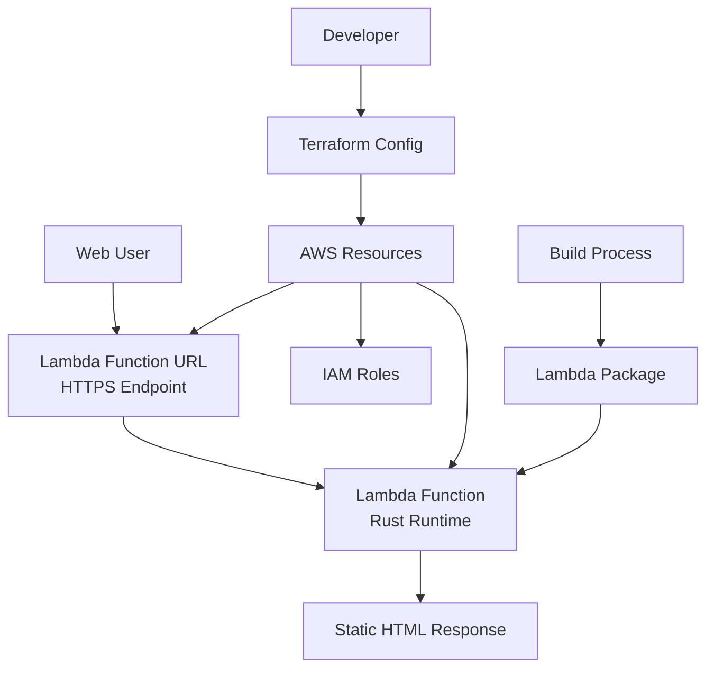

# Design Document: Static Web Lambda

## Overview

This system implements a serverless static web server using Rust and AWS Lambda. The architecture leverages the official AWS Lambda Rust runtime (`lambda_runtime` and `lambda_http` crates) to serve a single static HTML page through AWS Lambda Function URLs. The infrastructure is managed using Terraform for reproducible deployments.

The design prioritizes simplicity and beginner-friendliness while following Rust best practices. Lambda Function URLs provide direct HTTP access without the complexity and cost of API Gateway, making this ideal for simple static content serving.

## Architecture



The system follows a serverless architecture pattern where:
- Lambda Function URL provides a direct HTTPS endpoint for the Lambda function
- The Lambda function processes HTTP requests and returns static HTML content
- Terraform manages all AWS resources as Infrastructure as Code
- A build process compiles Rust code into a Lambda-compatible deployment package

## Components and Interfaces

### 1. Rust Lambda Function (`src/main.rs`)

**Purpose**: Core application logic that handles HTTP requests and serves static content.

**Key Dependencies**:
- `lambda_runtime`: Official AWS Lambda runtime for Rust
- `lambda_http`: HTTP-specific Lambda event handling (works with Function URLs)
- `tokio`: Async runtime (required by lambda_runtime)
- `serde_json`: JSON serialization for Lambda responses

**Interface**:
```rust
// Main handler function signature
async fn function_handler(event: Request) -> Result<Response<Body>, Error>

// Response structure for Lambda Function URL
Response {
    status_code: 200,
    headers: {"content-type": "text/html"},
    body: "<html>...</html>"
}
```

**Implementation Strategy**:
- Use `lambda_http::run` to start the Lambda runtime
- Implement a single handler function that returns the same HTML for all requests
- Include extensive comments explaining Rust concepts (ownership, async/await, Result types)
- Handle errors gracefully with proper logging

### 2. Static HTML Content

**Purpose**: The HTML page served to users, embedded directly in the Rust code for simplicity.

**Content Structure**:
- Valid HTML5 document with DOCTYPE
- Basic styling for visual appeal
- Responsive design for mobile compatibility
- Meta tags for proper rendering

**Storage Strategy**: Embedded as a string constant in the Rust code to avoid external file dependencies in Lambda.

### 3. Terraform Infrastructure (`terraform/`)

**Purpose**: Infrastructure as Code for AWS resource management.

**Resources to Create**:
- `aws_lambda_function`: The Rust Lambda function
- `aws_lambda_function_url`: Direct HTTP endpoint for the Lambda function
- `aws_iam_role`: Lambda execution role
- `aws_iam_role_policy_attachment`: Basic Lambda execution policy
- `aws_cloudwatch_log_group`: Log group for Lambda function logs

**Configuration Strategy**:
- Use variables for configurable values (function name, region)
- Output the Lambda Function URL for easy access
- Include comprehensive comments explaining each resource
- Follow AWS security best practices with least-privilege IAM
- Configure CORS settings for browser compatibility

### 4. Build System

**Purpose**: Compile Rust code for AWS Lambda and create deployment packages.

**Components**:
- `Cargo.toml`: Rust project configuration with Lambda dependencies
- Build script: Cross-compilation for Lambda runtime (Amazon Linux)
- Packaging: Create ZIP file for Terraform deployment

**Build Process**:
1. Cross-compile Rust code for `x86_64-unknown-linux-gnu` target
2. Create `bootstrap` executable (required name for Lambda custom runtime)
3. Package into ZIP file for Lambda deployment
4. Terraform references the ZIP file for function deployment

## Data Models

### HTTP Request Processing

```rust
// Incoming HTTP request (handled by lambda_http)
struct HttpRequest {
    path: String,           // Request path (e.g., "/", "/about")
    method: String,         // HTTP method (GET, POST, etc.)
    headers: HashMap<String, String>,
    query_parameters: Option<HashMap<String, String>>,
    body: Option<String>,
}

// Lambda response (returned via Function URL)
struct HttpResponse {
    status_code: u16,       // HTTP status (200, 404, etc.)
    headers: HashMap<String, String>,
    body: String,           // HTML content
    is_base64_encoded: bool, // Always false for HTML
}
```

### Configuration Data

```rust
// Environment variables available in Lambda
struct LambdaConfig {
    aws_lambda_function_name: String,
    aws_lambda_function_version: String,
    aws_region: String,
}

// Static content configuration
struct ContentConfig {
    html_content: &'static str,  // Embedded HTML
    content_type: &'static str,  // "text/html"
}
```

## Correctness Properties

*A property is a characteristic or behavior that should hold true across all valid executions of a system—essentially, a formal statement about what the system should do. Properties serve as the bridge between human-readable specifications and machine-verifiable correctness guarantees.*

### Property Reflection

After reviewing the prework analysis, I identified several properties that can be combined for better coverage:
- Properties 1.1 and 1.4 both test HTTP response correctness and can be combined
- Properties 2.2 and 1.2 both test content consistency and can be combined  
- Properties 5.1 and 5.2 both test local/Lambda consistency and can be combined

### Converting EARS to Properties

Based on the prework analysis, here are the testable correctness properties:

**Property 1: HTTP Response Correctness**
*For any* valid HTTP GET request, the response should have status code 200, contain valid HTML5 markup with proper DOCTYPE, and include Content-Type header set to "text/html"
**Validates: Requirements 1.1, 1.3, 1.4**

**Property 2: Path Independence**
*For any* HTTP request path, the returned HTML content should be identical regardless of the requested path
**Validates: Requirements 1.2**

**Property 3: Function URL Event Processing**
*For any* valid HTTP request received via Lambda Function URL, the system should process it and return a properly formatted HTTP response
**Validates: Requirements 2.2**

**Property 4: Request Logging**
*For any* HTTP request processed by the system, a corresponding log entry should be created containing request and response information
**Validates: Requirements 2.4**

**Property 5: Local-Lambda Consistency**
*For any* HTTP request, the handler function should produce identical responses when running locally and when deployed to Lambda
**Validates: Requirements 5.1, 5.2**

**Property 6: Error Handling**
*For any* error condition that occurs during request processing, the system should return appropriate error messages and log the error details
**Validates: Requirements 5.4**

**Property 7: Security Header Validation**
*For any* HTTP response, the system should include appropriate security headers (X-Content-Type-Options, X-Frame-Options, Content-Security-Policy)
**Validates: Requirements 3.4**

**Property 8: Input Sanitization**
*For any* HTTP request, the system should sanitize and validate all input parameters to prevent injection attacks
**Validates: Requirements 3.4**

## Security Considerations

The system implements multiple layers of security to protect against common web vulnerabilities:

### Input Validation and Sanitization

**Request Validation**:
- Validate HTTP method (only allow GET requests for static content)
- Sanitize request paths to prevent directory traversal attacks
- Limit request size to prevent DoS attacks
- Validate headers to prevent header injection

**Implementation**:
```rust
fn validate_request(request: &Request) -> Result<(), SecurityError> {
    // Only allow GET requests
    if request.method() != "GET" {
        return Err(SecurityError::InvalidMethod);
    }
    
    // Sanitize path to prevent directory traversal
    let path = sanitize_path(request.uri().path())?;
    
    // Validate request size
    if request.body().len() > MAX_REQUEST_SIZE {
        return Err(SecurityError::RequestTooLarge);
    }
    
    Ok(())
}
```

### Security Headers

**Required Security Headers**:
- `X-Content-Type-Options: nosniff` - Prevent MIME type sniffing
- `X-Frame-Options: DENY` - Prevent clickjacking attacks
- `X-XSS-Protection: 1; mode=block` - Enable XSS protection
- `Content-Security-Policy: default-src 'self'` - Restrict resource loading
- `Strict-Transport-Security: max-age=31536000` - Enforce HTTPS

**Implementation**:
```rust
fn add_security_headers(response: &mut Response<Body>) {
    let headers = response.headers_mut();
    headers.insert("X-Content-Type-Options", "nosniff".parse().unwrap());
    headers.insert("X-Frame-Options", "DENY".parse().unwrap());
    headers.insert("X-XSS-Protection", "1; mode=block".parse().unwrap());
    headers.insert("Content-Security-Policy", "default-src 'self'".parse().unwrap());
    headers.insert("Strict-Transport-Security", "max-age=31536000".parse().unwrap());
}
```

### AWS Security Configuration

**IAM Security**:
- Least-privilege IAM role for Lambda execution
- No unnecessary permissions beyond basic Lambda execution
- CloudWatch Logs access only for the specific log group
- No access to other AWS services unless required

**Lambda Security**:
- Function URL configured with CORS restrictions
- No environment variables containing sensitive data
- Dead letter queue for failed invocations (optional)
- Reserved concurrency to prevent resource exhaustion

**Terraform Security Configuration**:
```hcl
# Least-privilege IAM role
resource "aws_iam_role" "lambda_role" {
  name = "static-web-lambda-role"
  
  assume_role_policy = jsonencode({
    Version = "2012-10-17"
    Statement = [
      {
        Action = "sts:AssumeRole"
        Effect = "Allow"
        Principal = {
          Service = "lambda.amazonaws.com"
        }
      }
    ]
  })
}

# Function URL with CORS configuration
resource "aws_lambda_function_url" "static_web_url" {
  function_name      = aws_lambda_function.static_web.function_name
  authorization_type = "NONE"  # Public access for static content
  
  cors {
    allow_credentials = false
    allow_origins     = ["*"]  # Restrict in production
    allow_methods     = ["GET"]
    allow_headers     = ["date", "keep-alive"]
    expose_headers    = ["date", "keep-alive"]
    max_age          = 86400
  }
}
```

### Content Security

**HTML Content Security**:
- Static HTML content is hardcoded (no user input)
- No external script or style dependencies
- All content served with proper Content-Type headers
- No dynamic content generation that could introduce XSS

**Logging Security**:
- Sanitize logged data to prevent log injection
- No sensitive information in logs (IP addresses are acceptable)
- Structured logging to prevent log parsing attacks

### Runtime Security

**Error Handling Security**:
- Generic error messages to prevent information disclosure
- Detailed errors only in logs, not in responses
- No stack traces or internal paths exposed to users
- Rate limiting through AWS Lambda concurrency controls

**Dependency Security**:
- Use only well-maintained, official AWS crates
- Regular dependency updates for security patches
- Minimal dependency tree to reduce attack surface
- Pin dependency versions for reproducible builds

## Error Handling

The system implements comprehensive error handling at multiple levels:

**Lambda Runtime Errors**:
- Cold start failures: Log initialization errors and return 500 status
- Memory/timeout errors: Handled by AWS Lambda runtime with proper logging
- Invalid request format: Return 400 status with error message

**Application Errors**:
- HTML generation errors: Return 500 status with generic error message (no internal details)
- Logging failures: Continue processing but log the logging failure
- Configuration errors: Fail fast during initialization with clear error messages
- Security violations: Return 400/403 status with generic security error message

**Security Error Handling**:
- Invalid methods: Return 405 Method Not Allowed
- Malicious paths: Return 400 Bad Request with generic message
- Oversized requests: Return 413 Request Entity Too Large
- All security errors logged with full details for monitoring

**Error Response Format**:
```rust
struct ErrorResponse {
    status_code: u16,        // 400, 403, 405, 500, etc.
    error_message: String,   // Generic user-friendly error message
    request_id: String,      // Lambda request ID for debugging
    // Note: Detailed error info only in logs, never in response
}

// Security-specific error types
enum SecurityError {
    InvalidMethod,
    MaliciousPath,
    RequestTooLarge,
    HeaderInjection,
}
```

## Testing Strategy

The testing approach combines unit tests for specific scenarios with property-based tests for comprehensive coverage:

**Unit Testing**:
- Test specific HTML content validation
- Test error conditions (malformed requests, initialization failures)
- Test logging functionality with mock loggers
- Test local development server functionality
- Test security header injection and validation
- Test input sanitization with known malicious inputs
- Test CORS configuration and restrictions
- Integration tests for Terraform deployment (optional)

**Property-Based Testing**:
- Use `proptest` crate for property-based testing in Rust
- Generate random HTTP requests to test path independence
- Generate various request formats to test response consistency
- Test error conditions with invalid inputs
- Test security validation with malicious inputs (path traversal, oversized requests)
- Generate requests with various headers to test security header injection
- Minimum 100 iterations per property test for thorough coverage

**Test Configuration**:
- Each property test references its design document property
- Tag format: **Feature: static-web-lambda, Property {number}: {property_text}**
- Tests run in both local and CI/CD environments
- Separate test suite for Terraform infrastructure validation

**Testing Framework Setup**:
```rust
// Example property test structure
#[cfg(test)]
mod tests {
    use proptest::prelude::*;
    
    proptest! {
        #[test]
        // Feature: static-web-lambda, Property 1: HTTP Response Correctness
        fn test_http_response_correctness(path in ".*") {
            // Test implementation
        }
    }
}
```